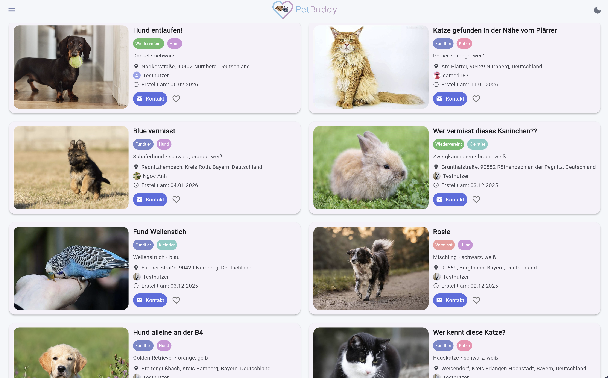

# Beispieldaten

Um die Anwendung ohne eigene Registrierung ausprobieren zu können, stehen ein Test-Account und vorbereitete Beispieldaten zur Verfügung. Diese Seite hilft Ihnen, sich schnell mit den Funktionen von PetBuddy vertraut zu machen, indem sie Ihnen vordefinierte Daten und Szenarien an die Hand gibt.

---

## Test-Account

Für einen schnellen Test der Anwendung ohne eigene Registrierung können Sie den bereitgestellten Test-Account nutzen.

| Feld | Wert |
|------|------|
| **E-Mail** | `test@gmail.com` |
| **Passwort** | `test123456` |

---

## Beispiel-Meldungen

Es sind bereits Meldungen mit unterschiedlichen Tierarten, Standorten und Status (Vermisst / Fundtier) vorhanden, um die Such- und Filterfunktionen zu testen.

*Abbildung: Beispielmeldungen*

---

## Demonstrationsszenarien

Die folgenden Szenarien führen Sie Schritt für Schritt durch die wichtigsten Arbeitsabläufe der App.

### Szenario 1: Ein vermisstes Tier melden
Dieses Szenario führt Sie durch den Prozess der Erstellung einer neuen Meldung für ein vermisstes Tier.

1.  **Anmelden:** Nutzen Sie den Test-Account (`test@gmail.com` / `test123456`), um sich anzumelden.
2.  **Meldung starten:** Öffnen Sie das Menü und klicken Sie auf **Melden**.
3.  **Formular ausfüllen:** Füllen Sie die wichtigsten Felder aus, wie z.B. "Vermisst", Tierart "Hund", und laden Sie ein Beispielfoto hoch.
4.  **Speichern:** Klicken Sie auf **Meldung erstellen**, um den Vorgang abzuschließen. Ihre Meldung ist nun für alle sichtbar.

### Szenario 2: Nach einer bestimmten Katze suchen
Dieses Szenario zeigt Ihnen, wie Sie die Filterfunktionen nutzen, um gezielt nach einem Tier zu suchen.

1.  **Filter anwenden:** Gehen Sie zur Startseite und setzen Sie die Filter:
    -   **Kategorie:** `Vermisst`
    -   **Tierart:** `Katze`
    -   **Ort:** `Nürnberg`
2.  **Ergebnisse prüfen:** Die Ansicht aktualisiert sich automatisch und zeigt nur die Meldungen an, die Ihren Kriterien entsprechen.

### Szenario 3: Eine Meldung als Favorit speichern
Lernen Sie, wie Sie relevante Meldungen für einen späteren schnellen Zugriff speichern.

1.  **Meldung finden:** Suchen Sie eine beliebige Meldung in der Grid- oder Kartenansicht.
2.  **Favorit hinzufügen:** Klicken Sie auf das **Herz-Symbol** auf der Meldungskarte.
3.  **Liste prüfen:** Öffnen Sie das Menü und gehen Sie zu **Favoritenlisten**, um zu sehen, ob die Meldung dort erscheint.

### Szenario 4: Einen Kommentar hinterlassen
Dieses Szenario zeigt, wie Sie mit anderen Nutzern über eine Meldung kommunizieren können.

1.  **Meldung öffnen:** Klicken Sie auf eine Meldung, um die Detailansicht zu öffnen.
2.  **Kommentar schreiben:** Geben Sie einen Test-Kommentar in das Textfeld ein und klicken Sie auf **Absenden-Symbol**.
3.  **Antworten (optional):** Testen Sie die Antwortfunktion, indem Sie auf Ihren eigenen Kommentar antworten.

### Szenario 5: Die KI-Rassenerkennung nutzen
Dieses Szenario demonstriert die automatische Erkennung von Tierart und Rasse bei einem Fundtier.

1.  **Meldung starten:** Erstellen Sie eine neue Meldung und wählen Sie als Meldungsart **„Fundtier"**.
2.  **Foto hochladen:** Laden Sie ein Foto eines Tieres hoch.
3.  **KI starten:** Klicken Sie auf **„🤖 KI-Rassenerkennung starten"** und bestätigen Sie den Hinweis.
4.  **Ergebnis prüfen:** Übernehmen oder verwerfen Sie den Vorschlag der KI.

### Szenario 6: Eine Suche speichern und anwenden
Lernen Sie, wie Sie wiederkehrende Suchanfragen für eine schnelle Wiederverwendung speichern.

1.  **Filter setzen:** Stellen Sie beliebige Filter ein (z.B. Tierart "Hund" in "Nürnberg").
2.  **Suche speichern:** Klicken Sie auf **„Suche speichern"** und geben Sie einen Namen ein.
3.  **Suche anwenden:** Gehen Sie ins Menü zu **Gespeicherte Suche** und klicken Sie auf **Suche anwenden**, um die Filter erneut zu laden.

### Szenario 7: Einen Aushang als PDF exportieren
Dieses Szenario zeigt, wie Sie eine Meldung als PDF-Datei für einen physischen Aushang exportieren.

1.  **Eigene Meldungen öffnen:** Gehen Sie im Menü zu **Meine Meldungen**.
2.  **PDF-Export starten:** Klicken Sie auf das **PDF-Symbol** unter einer Ihrer Meldungen.
3.  **Kontaktdaten eingeben:** Fügen Sie optional Ihre Telefonnummer oder E-Mail hinzu.
4.  **PDF herunterladen:** Laden Sie das generierte PDF herunter.
