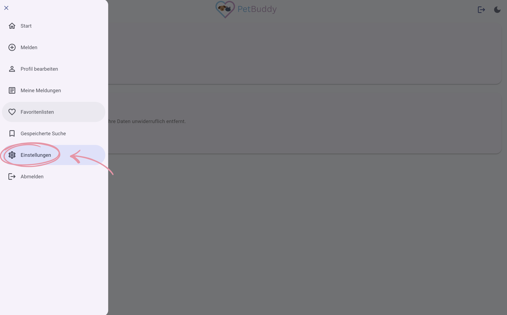
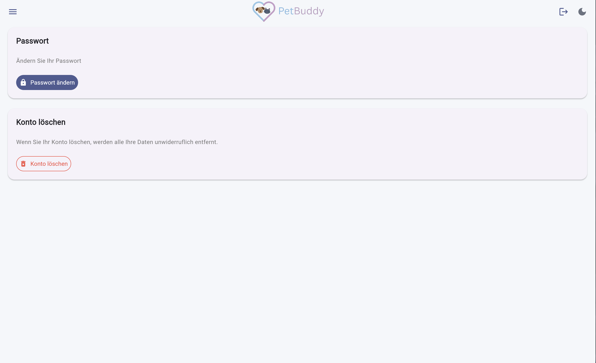
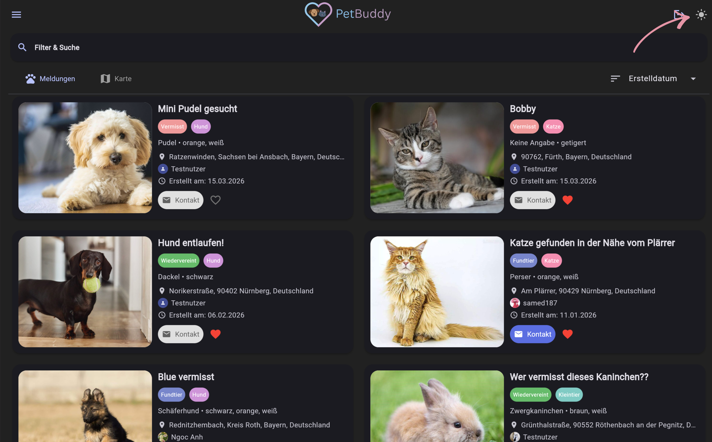
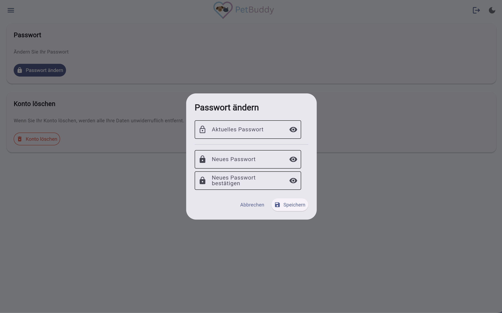
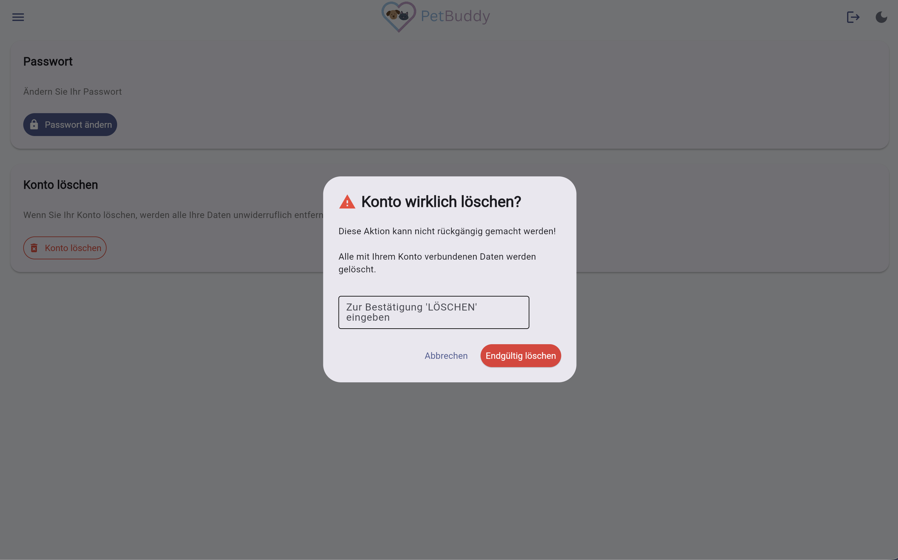

# Einstellungen

In diesem Bereich können Sie die Anwendung an Ihre persönlichen Vorlieben anpassen und sicherheitsrelevante Aktionen durchführen. Hier verwalten Sie Ihr Passwort, das Erscheinungsbild der App und können bei Bedarf Ihr Konto löschen.

!!! info "Anmeldung erforderlich"
    Dieser Bereich ist nur für angemeldete Nutzer zugänglich.

So gelangen Sie zu den Einstellungen: Menü → **Einstellungen**

*Abbildung: Menüpunkt "Einstellungen"*

*Abbildung: Einstellungsseite*

---

## Design (Hell-/Dunkelmodus)

Klicken Sie auf das **Sonnen-/Mond-Symbol** in der AppBar, um zwischen Hell- und Dunkelmodus zu wechseln.

*Abbildung: Symbol zum Wechseln des Designs*

---

## Passwort ändern

Um Ihr Passwort zu aktualisieren, gehen Sie wie folgt vor:

1. Klicken Sie auf **„Passwort ändern"**.
2. Geben Sie Ihr aktuelles Passwort ein.
3. Geben Sie Ihr neues Passwort ein (mind. 8 Zeichen, Groß-/Kleinbuchstabe, Zahl, Sonderzeichen) und bestätigen Sie es.
4. Klicken Sie auf **Speichern**.
5. Sie erhalten eine **Bestätigungs-E-Mail**.

*Abbildung: Dialog zum Ändern des Passworts*

---

## Konto löschen

Um Ihr PetBuddy-Konto und alle damit verbundenen Daten dauerhaft zu entfernen, klicken Sie auf **„Konto löschen"** und bestätigen Sie den anschließenden Dialog.

Alle Ihre Daten (Meldungen, Fotos, Kommentare etc.) werden daraufhin gelöscht.

*Abbildung: Dialog zum Löschen des Kontos*

!!! warning "Nicht rückgängig machbar"
    Die Kontolöschung ist endgültig. Alle Daten werden sofort und unwiderruflich entfernt.
