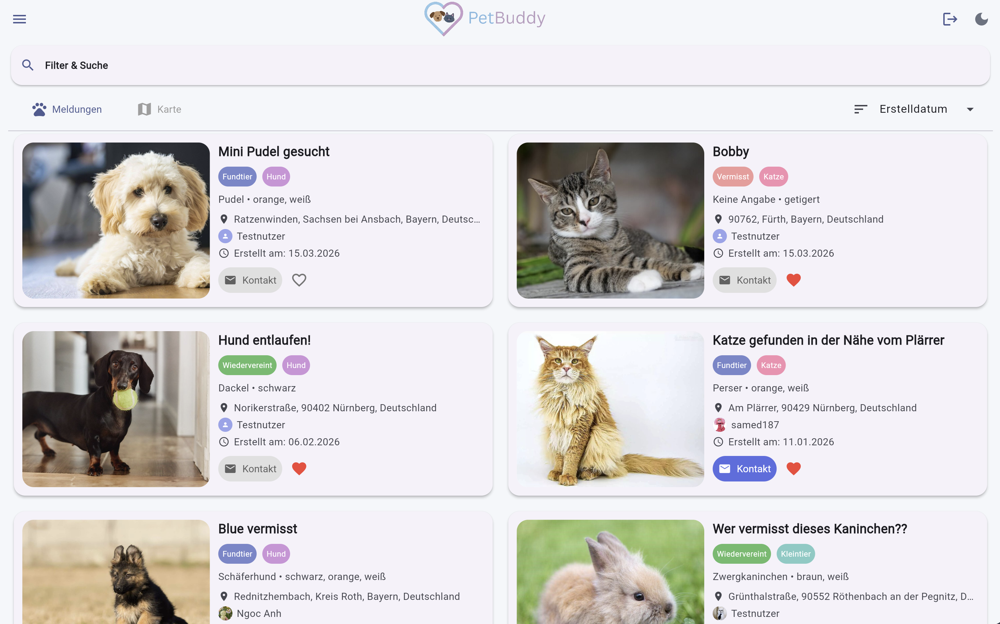
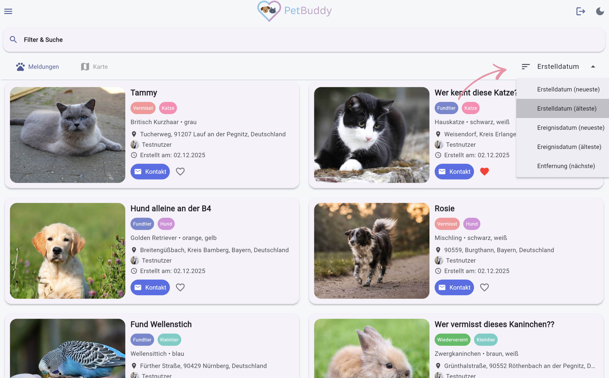
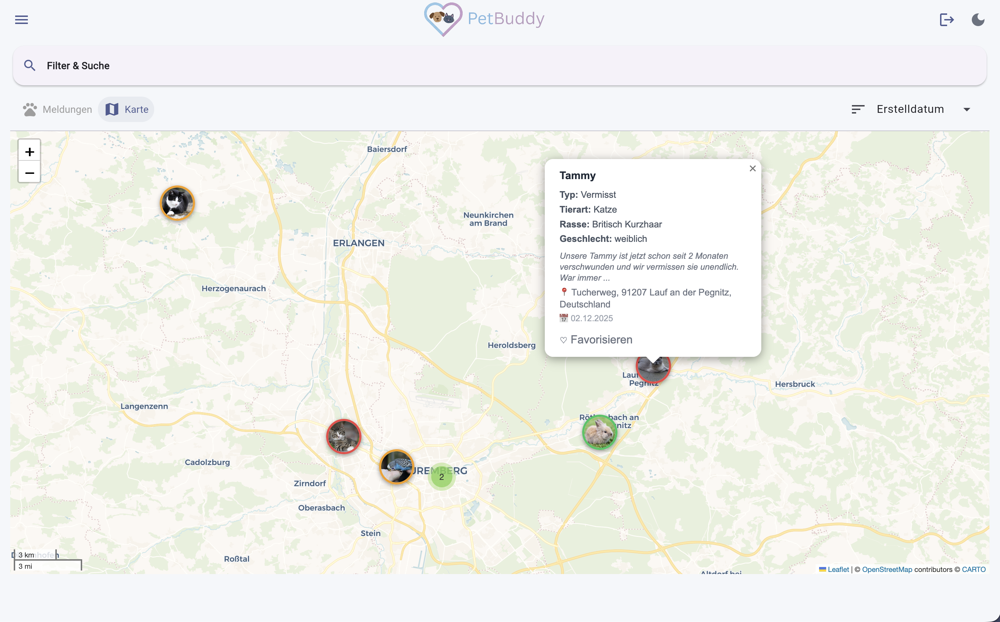
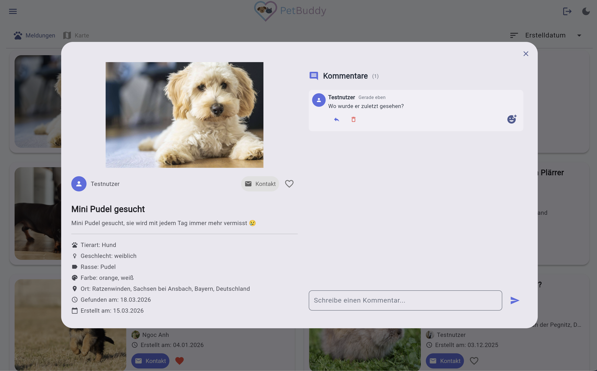
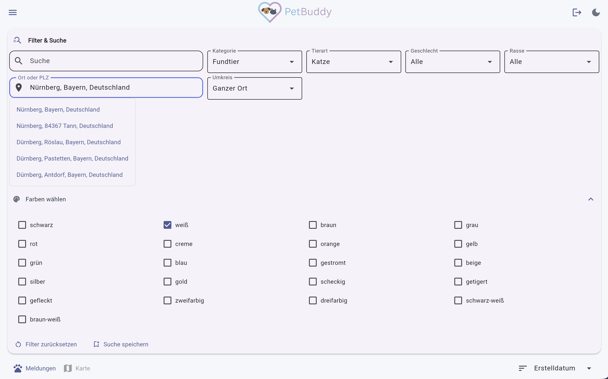
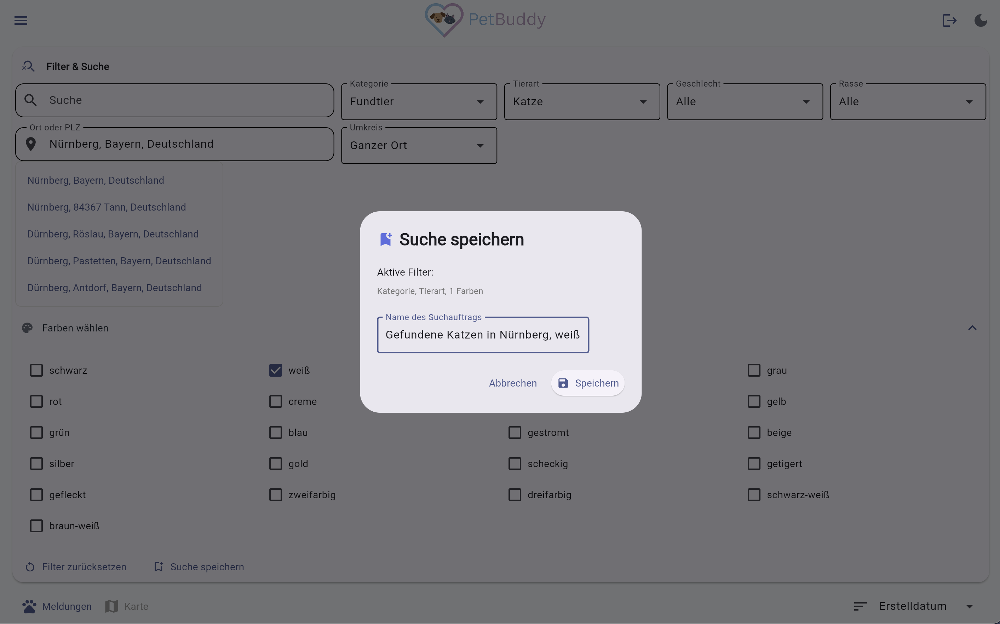

# Entdecken & Suchen

Die Startseite ist der zentrale Einstiegspunkt von PetBuddy. Hier sehen Sie alle aktuellen Meldungen über vermisste und gefundene Tiere. Diese Funktion dient dazu, Ihnen einen schnellen Überblick über die Tiersichtungen in Ihrer Umgebung zu geben und gezielt nach vermissten oder gefundenen Tieren zu suchen.

---

## Übersicht

Um sich einen Überblick über alle aktuellen Meldungen zu verschaffen, öffnen Sie die **Startseite**. Dort sehen Sie alle aktiven Meldungen und können zwischen der **Gridansicht** und der **Kartenansicht** wechseln.

### Gridansicht

In der Gridansicht werden alle Meldungen als Karten in einem responsiven Raster dargestellt. Jede Karte enthält:

- Foto
- Status-Badge (Vermisst / Fundtier / Wiedervereint)
- Tierart-Badge (Hund / Katze / Kleintier)
- Titel
- Favoriten-Herz
- Kontakt-Button
- Standort
- Ersteller
- Erstelldatum

*Abbildung: Gridansicht mit Meldungskarten*

Über der Gridansicht befindet sich eine **Sortierfunktion**, mit der die Reihenfolge der Meldungen angepasst werden kann:

- Erstelldatum (neueste zuerst): Sortiert nach dem Datum, an dem die Meldung erstellt wurde (Standard).
- Erstelldatum (älteste zuerst)
- Ereignisdatum (neueste zuerst): Sortiert nach dem Vermisst- oder Funddatum.
- Ereignisdatum (älteste zuerst)
- Entfernung (erscheint, sobald ein Ort gefiltert wird)

*Abbildung: Sortierauswahl*

### Kartenansicht

In der Kartenansicht werden alle Meldungen als Marker auf einer interaktiven Karte angezeigt. Klicken Sie auf einen Marker, um die Kurzinfos zu sehen.

Farblegende der Marker:

- Orange: Fundtier
- Rot: Vermisst
- Grün: Wiedervereint

*Abbildung: Kartenansicht mit Markern*

!!! info "Filter in der Kartenansicht"
    Die Filter funktionieren sowohl in der Gridansicht als auch in der Kartenansicht.

### Detailansicht einer Meldung

Klicken Sie auf eine Meldungskarte, um die Detailansicht zu öffnen. Diese enthält:

- Foto in voller Größe
- Ersteller (Benutzername + Profilbild)
- Kontakt-Button, Favoriten-Button
- Titel, Beschreibung
- Tierart, Geschlecht, Rasse, Farben, Standort
- Vermisst- / Funddatum, Erstelldatum
- Kontaktdaten (falls vom Ersteller angegeben) – über den Kontakt-Button
- Kommentare (siehe Abschnitt [Kommentare](kommentare.md))

*Abbildung: Detailansicht einer Meldung*

---

## Filter

Über der Ergebnisliste stehen verschiedene Filter zur Verfügung, um die Ergebnisse einzugrenzen:

| Filter | Optionen |
|--------|----------|
| **Freitextsuche** | Durchsucht Titel und Beschreibung |
| **Kategorie** | Alle · Vermisst · Fundtier · Wiedervereint |
| **Tierart** | Hund · Katze · Kleintier |
| **Geschlecht** | Männlich · Weiblich · Unbekannt |
| **Rasse** | Wird dynamisch nach Tierart geladen |
| **Ort/PLZ + Umkreis** | Ortsname oder PLZ eingeben → Autocomplete → Radius wählen (Ganzer Ort / 5 / 10 / 25 / 50 km / ...) |
| **Farben** | Mehrfachauswahl per Checkboxen (aufklappbar) |

Alle Filter können über **„Filter zurücksetzen"** auf den Standard zurückgesetzt werden.

*Abbildung: Filterleiste*

---

## Suche speichern

Speichern Sie Ihre Suche, um sie später mit einem Klick erneut anzuwenden:

1. Gewünschte Filter setzen.
2. Auf **„Suche speichern"** klicken.
3. Einen Namen für die Suche vergeben (max. 100 Zeichen).
4. Die Suche erscheint im Menü unter **Gespeicherte Suche** (max. 20 pro Account).

*Abbildung: Dialog zum Speichern einer Suche*

Weitere Informationen zur Verwaltung gespeicherter Suchen finden Sie unter [Favoriten & Gespeicherte Suchen](favoriten_gespeicherte_suchen.md#gespeicherte-suchen).
