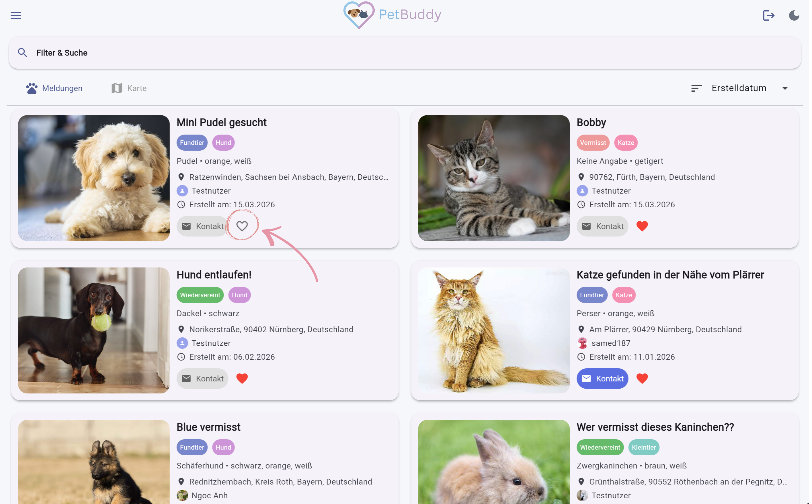
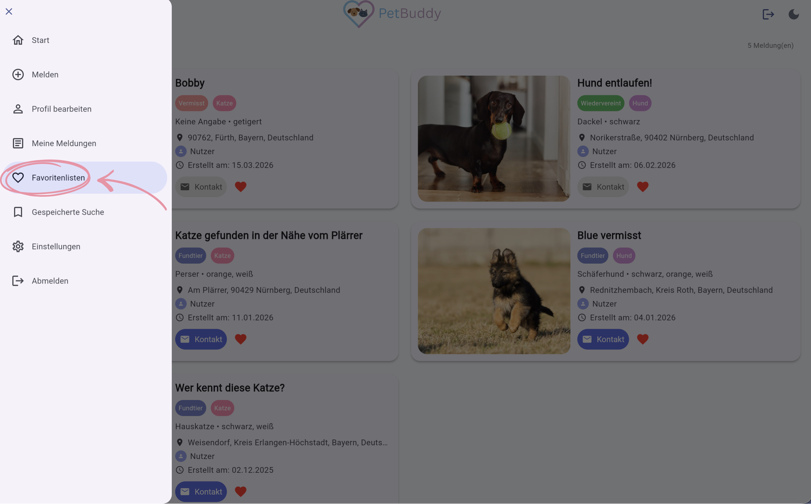
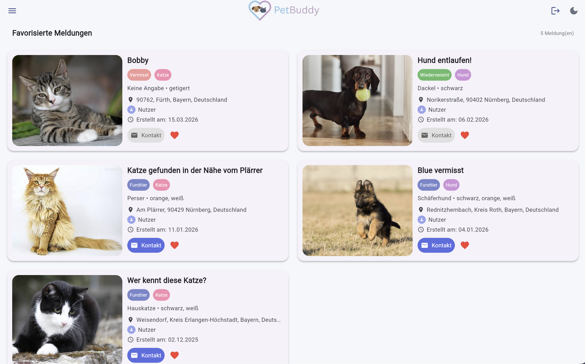
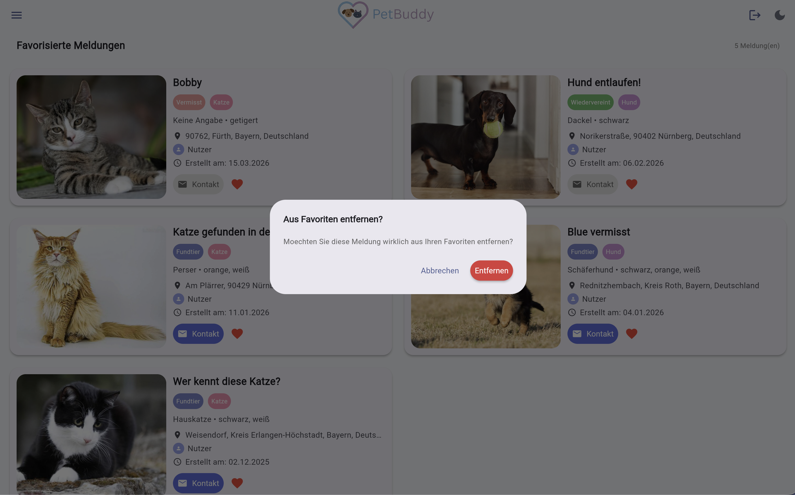
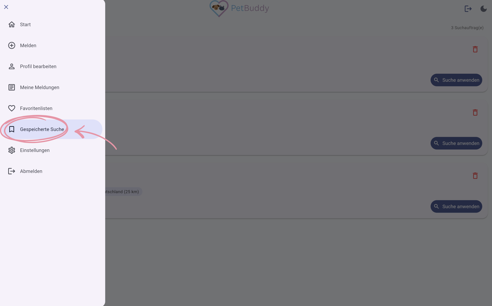
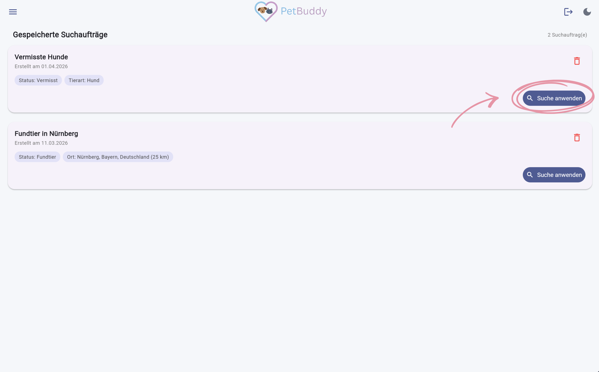
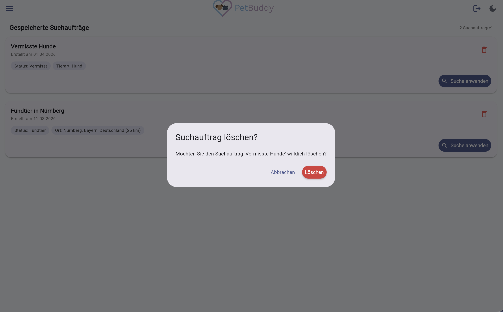

# Favoriten & Gespeicherte Suchen

Mit Favoriten und gespeicherten Suchen behalten Sie den Überblick über Meldungen, die für Sie relevant sind. Diese Funktionen helfen Ihnen, interessante Meldungen schnell wiederzufinden und wiederkehrende Suchanfragen effizient durchzuführen.

!!! info "Anmeldung erforderlich"
    Favoriten und gespeicherte Suchen können nur von angemeldeten Nutzern verwendet werden.

---

## Favoriten

### Hinzufügen

Um eine interessante Meldung für später zu speichern, klicken Sie auf das **Herz-Symbol** auf einer Meldungskarte. Das Herz wird daraufhin rot gefüllt. Dies funktioniert in der Gridansicht, Kartenansicht und Detailansicht.

*Abbildung: Herz-Symbol für Favoriten*

### Entfernen

Um eine Meldung aus den Favoriten zu entfernen, klicken Sie erneut auf das gefüllte Herz.

### Favoritenliste anzeigen

Ihre Favoritenliste finden Sie im Menü unter **Favoritenlisten**.

*Abbildung: Menüpunkt "Favoritenlisten"*

Hier sehen Sie alle gespeicherten Favoriten als Gridansicht.

*Abbildung: Favoritenliste*

*Abbildung: Bestätigungsdialog zum Entfernen eines Favoriten*

---

## Gespeicherte Suchen

### Suche speichern

Wenn Sie eine bestimmte Suche häufiger durchführen, können Sie die Filtereinstellungen speichern, um sie nicht jedes Mal neu setzen zu müssen.

1. Setzen Sie die gewünschten Filter in der Übersicht.
2. Klicken Sie auf **„Suche speichern"**.
3. Vergeben Sie einen Namen (max. 100 Zeichen).

*Abbildung: Suche speichern*

!!! info "Limit"
    Pro Konto können maximal 20 Suchen gespeichert werden.

### Suche anwenden

Um eine zuvor gespeicherte Suche erneut auszuführen, gehen Sie wie folgt vor:

1. Menü → **Gespeicherte Suche**.
2. Klicken Sie auf **Suche anwenden**.
3. Die Filter werden sofort in der Übersicht angewendet.

*Abbildung: Menüpunkt "Gespeicherte Suche"*

*Abbildung: Gespeicherte Suche anwenden*

### Suche löschen

Wenn Sie eine gespeicherte Suche nicht mehr benötigen, klicken Sie auf das **Papierkorb-Symbol** auf der entsprechenden Suche und bestätigen Sie den Dialog.

*Abbildung: Bestätigungsdialog zum Löschen einer gespeicherten Suche*
