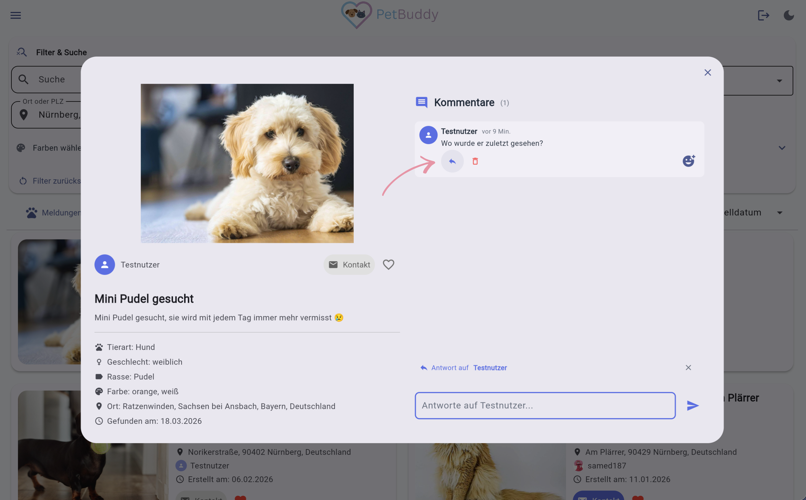
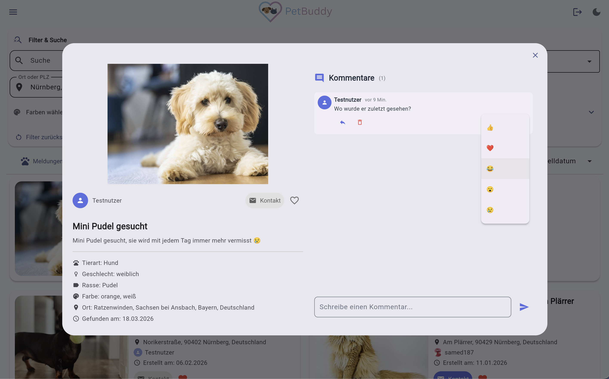
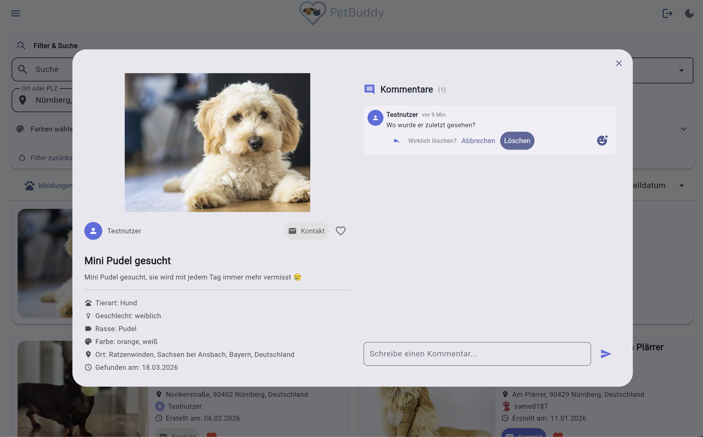

# Kommentare

Die Kommentarfunktion ermöglicht den direkten Austausch zwischen Nutzern zu einer bestimmten Meldung. Sie dient dazu, Hinweise zu geben, Fragen zu stellen oder Sichtungen zu teilen, um die Wiedervereinigung von Tier und Halter zu beschleunigen. Kommentare befinden sich in der **Detailansicht** einer Meldung – auf Desktop-Geräten rechts neben den Details, auf mobilen Geräten unterhalb.

---

## Kommentare lesen

Um zu sehen, ob es bereits Hinweise oder Fragen zu einer Meldung gibt, öffnen Sie einfach die Detailansicht. Kommentare sind für alle sichtbar, auch ohne Anmeldung.

*Abbildung: Kommentarbereich im Gastmodus*

---

## Kommentar schreiben

Um einen Hinweis zu hinterlassen oder eine Frage zu stellen, gehen Sie wie folgt vor:

1. Öffnen Sie die Detailansicht einer Meldung.
2. Geben Sie Ihren Text in das Textfeld ein (max. 1.000 Zeichen, Shift+Enter für Zeilenumbruch).
3. Klicken Sie auf das **Absenden-Symbol**.

!!! info "Anmeldung erforderlich"
    Zum Schreiben, Antworten und Reagieren auf Kommentare müssen Sie angemeldet sein.

---

## Antworten

Um gezielt auf einen bestimmten Kommentar einzugehen, klicken Sie auf das **Antwort-Symbol** unter dem entsprechenden Kommentar. Ihre Antwort wird eingerückt darunter angezeigt.

*Abbildung: Antwort auf einen Kommentar*

---

## Reaktionen

Um schnell auf einen Kommentar zu reagieren, ohne Text zu schreiben, klicken Sie auf eines der Emojis:

👍 ❤️ 😂 😮 😢

Erneutes Klicken entfernt die Reaktion. Die Anzahl der Reaktionen wird neben dem Emoji angezeigt.

*Abbildung: Emoji-Reaktionen*

---

## Kommentar löschen

Eigene Kommentare können über das **Papierkorb-Symbol** und nach einer Bestätigung im Dialog gelöscht werden.

*Abbildung: Kommentar löschen*