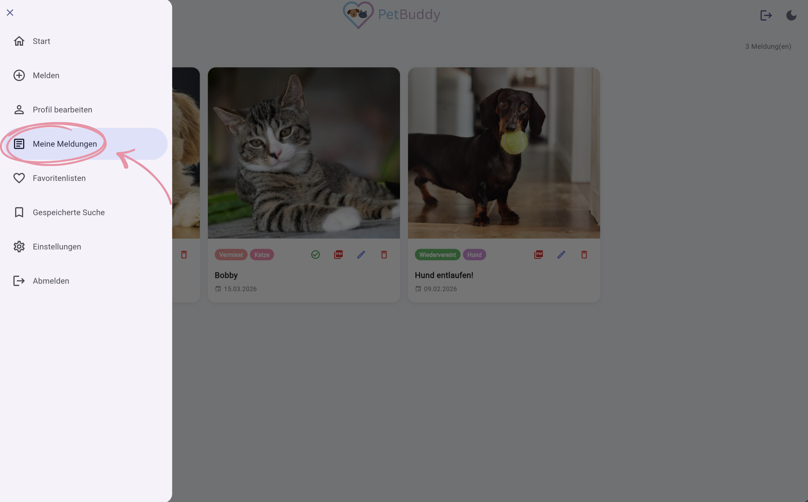
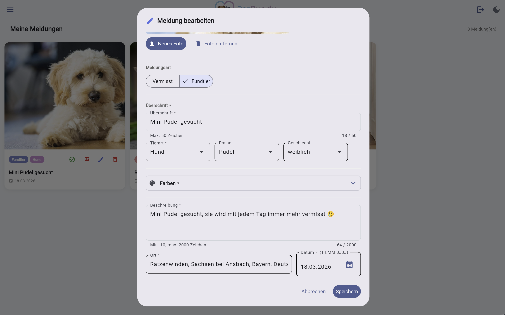
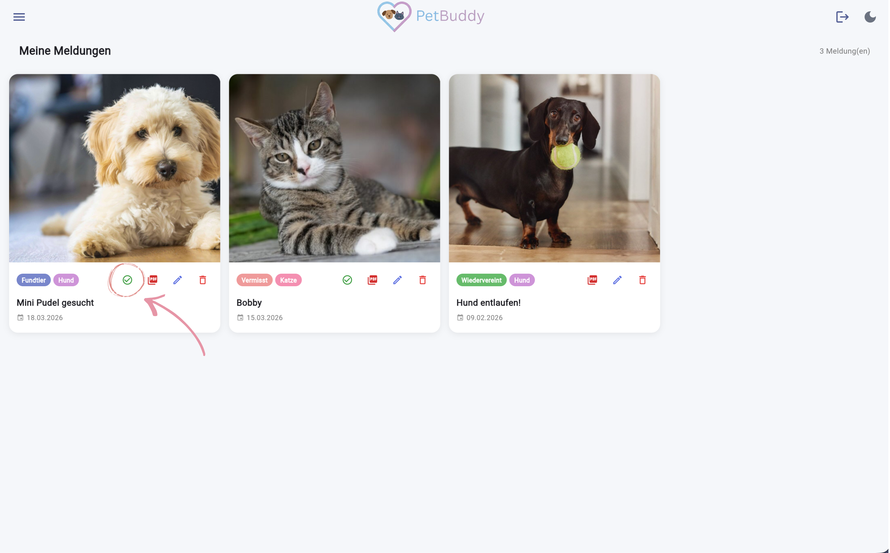
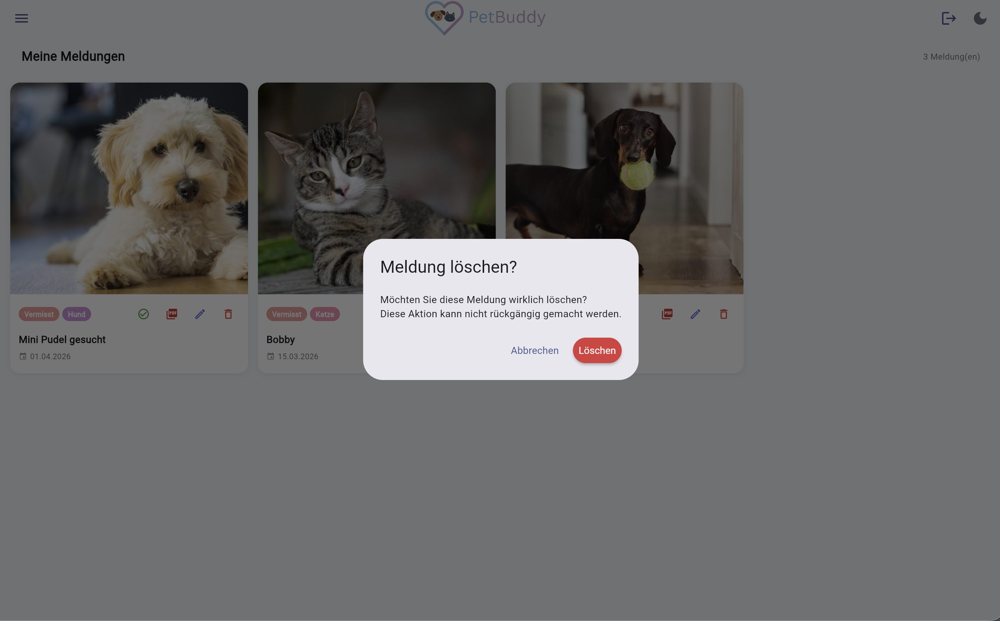
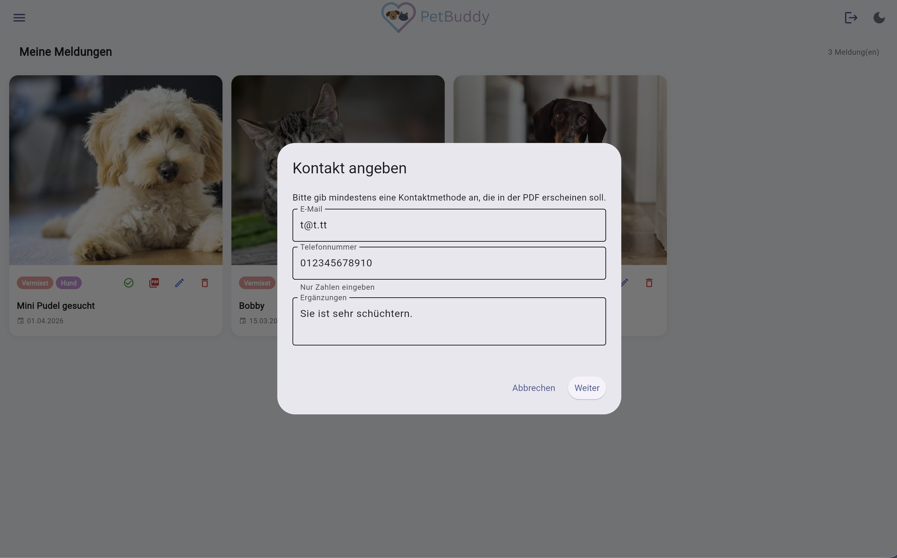
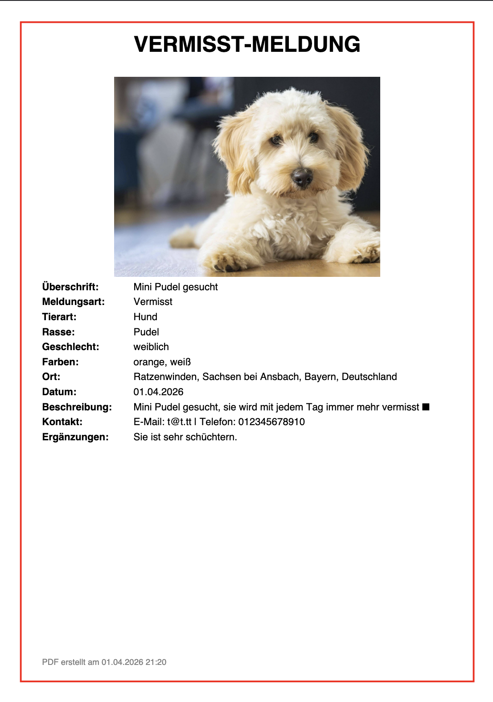

# Meine Meldungen

Im Bereich „Meine Meldungen" haben Sie die volle Kontrolle über die von Ihnen erstellten Einträge. Diese Funktion dient dazu, Ihre eigenen Meldungen zu verwalten, zu aktualisieren oder zu entfernen, sobald sie nicht mehr relevant sind.

!!! info "Anmeldung erforderlich"
    Dieser Bereich ist nur für angemeldete Nutzer zugänglich.

So gelangen Sie zu Ihren Meldungen: Menü → **Meine Meldungen**

*Abbildung: Menüpunkt "Meine Meldungen"*

Auf der Seite sehen Sie eine Übersicht Ihrer erstellten Meldungen.

*Abbildung: Übersicht der eigenen Meldungen*

---

## Meldung bearbeiten

Um eine bestehende Meldung zu aktualisieren oder zusätzliche Informationen hinzuzufügen, klicken Sie auf das **Bearbeiten-Symbol** auf der Meldung.

*Abbildung: Bearbeitungsfenster*

1. Ändern Sie die gewünschten Felder (Titel, Beschreibung, Ort, Farben, Foto, …).
2. Klicken Sie auf **Speichern**.

---

## Als „wiedervereint" markieren

Wenn Ihr vermisstes Tier wieder da ist oder ein Fundtier zurückgegeben wurde, markieren Sie die Meldung als abgeschlossen. Klicken Sie dazu auf **„Als wiedervereint markieren"**.

Der Status der Meldung wechselt zu „Wiedervereint" und das Datum wird auf den aktuellen Tag gesetzt.

*Abbildung: Button "Als wiedervereint markieren"*

---

## Meldung löschen

Um eine Meldung endgültig aus dem System zu entfernen, klicken Sie auf das **Papierkorb-Symbol** und bestätigen Sie den Dialog. Die Meldung wird daraufhin unwiderruflich gelöscht.

*Abbildung: Löschung bestätigen*

---

## PDF-Export

Um einen Aushang für die Offline-Suche zu erstellen, können Sie ein PDF Ihrer Meldung generieren. Klicken Sie dafür auf das **PDF-Symbol** neben einer Ihrer Meldungen.

Im anschließenden Dialog können Sie optional Kontaktdaten hinzufügen, die auf dem PDF erscheinen sollen.

*Abbildung: Dialog zur Eingabe von Kontaktdaten für das PDF*

Nach dem Klick auf **Download starten** wird die PDF-Datei generiert.

*Abbildung: Beispiel eines generierten PDF-Aushangs*
