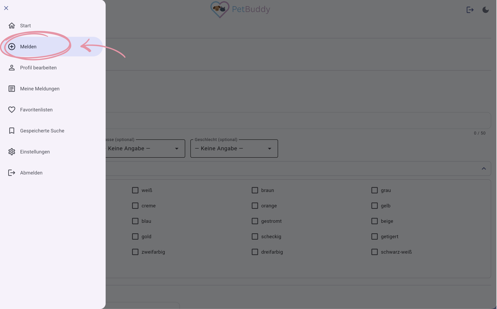
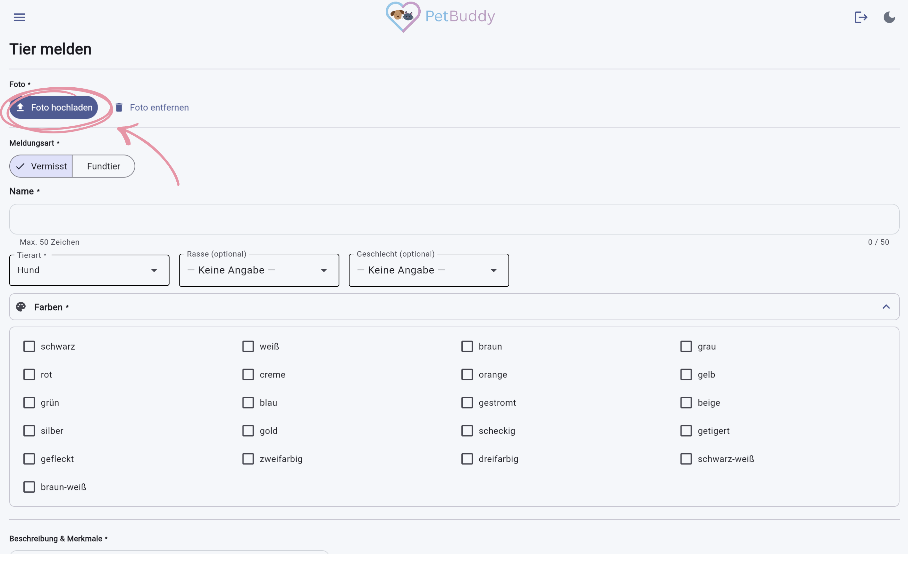
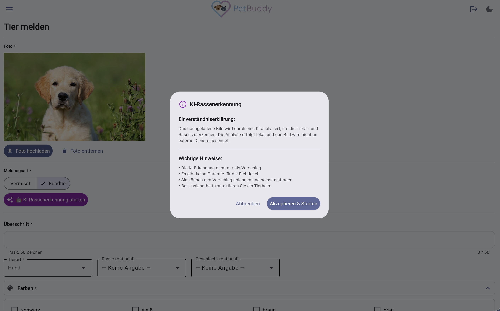
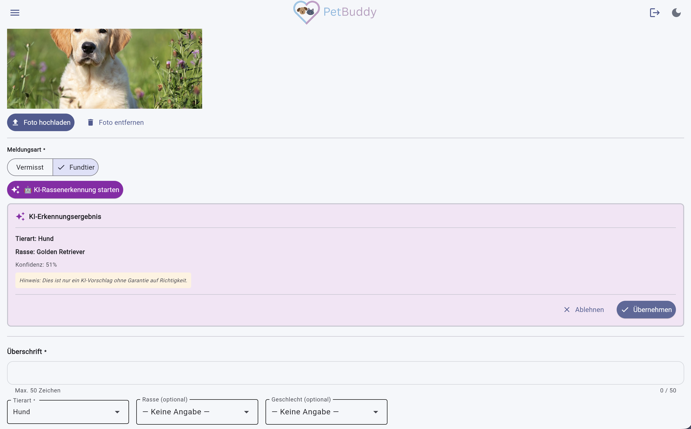
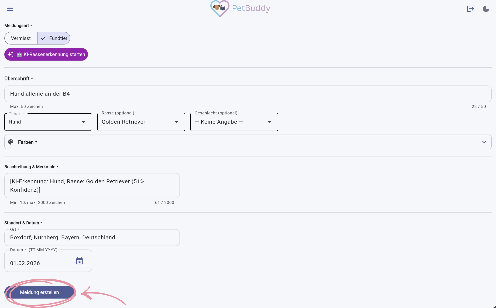

# Meldung erstellen

Diese Funktion ist das Herzstück von PetBuddy. Sie dient dazu, ein vermisstes oder gefundenes Tier zu melden, damit die Community bei der Suche helfen kann. Bei Fundtieren unterstützt eine KI-gestützte Rassenerkennung beim Ausfüllen des Formulars.

!!! info "Anmeldung erforderlich"
    Zum Erstellen einer Meldung müssen Sie angemeldet sein.

So erstellen Sie eine neue Meldung:

1. Menü → **Melden**.
2. Füllen Sie das Formular aus (siehe Felder unten).
3. Klicken Sie auf **Meldung erstellen**.

*Abbildung: Menüpunkt Melden*

---

## Foto

Ein aussagekräftiges Foto ist entscheidend, damit andere Nutzer das Tier eindeutig identifizieren können.

- Klicken Sie auf das Upload-Feld und wählen Sie ein Bild (JPG/PNG/WebP).
- Das Foto wird automatisch komprimiert.

*Abbildung: Foto hochladen*

!!! warning "Pflichtfeld"
    Ein Foto ist erforderlich, um eine Meldung zu erstellen, da es die wichtigste Information für die Wiedererkennung ist.

---

## KI-Rassenerkennung

Wenn Sie ein Tier gefunden haben, aber bei der Rasse unsicher sind, nutzen Sie die KI-Rassenerkennung. Diese analysiert Ihr Foto und schlägt eine passende Tierart und Rasse vor.

!!! info "Nur bei Fundtier"
    Die KI-Rassenerkennung ist ausschließlich bei der Meldungsart **Fundtier** verfügbar, um bei der Identifizierung unbekannter Tiere zu helfen.

1. Foto hochladen.
2. **„🤖 KI-Rassenerkennung starten"** anklicken.
3. Datenschutz-Hinweis bestätigen (Foto wird lokal analysiert, nicht extern gesendet).
4. Ergebnis prüfen: Tierart, Rasse und Konfidenzwert werden angezeigt.
5. **Übernehmen** füllt die Felder automatisch aus, oder **Ablehnen** für manuelle Eingabe.

*Abbildung: Einverständniserklärung zur KI-Analyse*

*Abbildung: KI-Erkennungsergebnis*

---

## Pflichtfelder

Die folgenden Felder sind Pflicht, um sicherzustellen, dass Ihre Meldung alle notwendigen Informationen für eine erfolgreiche Suche enthält.

| Feld | Beschreibung |
|------|-------------|
| **Foto** | Bild hochladen (JPG/PNG/WebP) |
| **Meldungsart** | Auswahl per Dropdown: **Vermisst** oder **Fundtier** |
| **Name / Überschrift** | z. B. „Grauer Kater vermisst" (max. 50 Zeichen). Bei Meldungsart „Vermisst" heißt das Feld **Name**, bei „Fundtier" heißt es **Überschrift**. |
| **Tierart** | Auswahl per Dropdown (Hund / Katze / Kleintier) |
| **Farben** | Mehrfachauswahl per Checkboxen |
| **Beschreibung** | Merkmale, Verhalten, Hinweise (min. 10 – max. 2.000 Zeichen) |
| **Ort** | Ort eingeben und aus den Vorschlägen (Autocomplete) auswählen. |
| **Datum** | Datum über Kalenderauswahl anpassen (standardmäßig heute). |

---

## Optionale Felder

Zusätzliche Details helfen, die Suche weiter zu präzisieren.

| Feld | Beschreibung |
|------|-------------|
| **Rasse** | Wird nach Tierart-Auswahl geladen |
| **Geschlecht** | Männlich / Weiblich / Unbekannt |

---

## Speichern

Nachdem Sie alle Angaben überprüft haben, klicken Sie auf **Meldung erstellen**. Die Meldung erscheint sofort in der Übersicht und ist für alle Nutzer sichtbar.

*Abbildung: Meldung erstellen*
