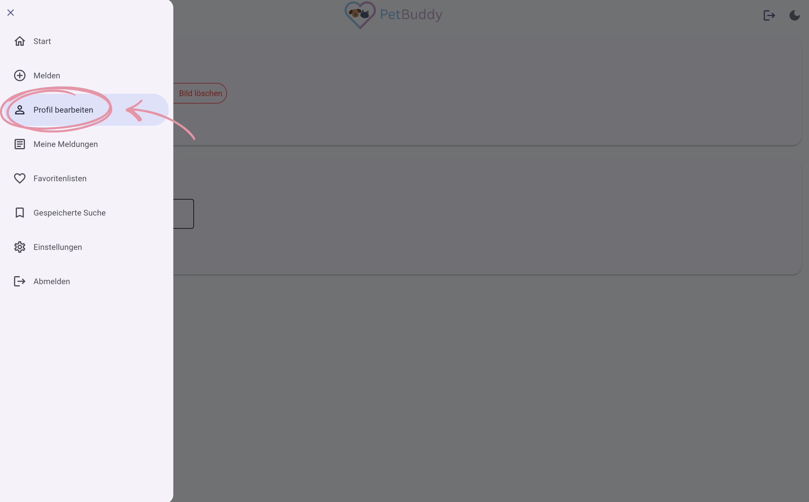
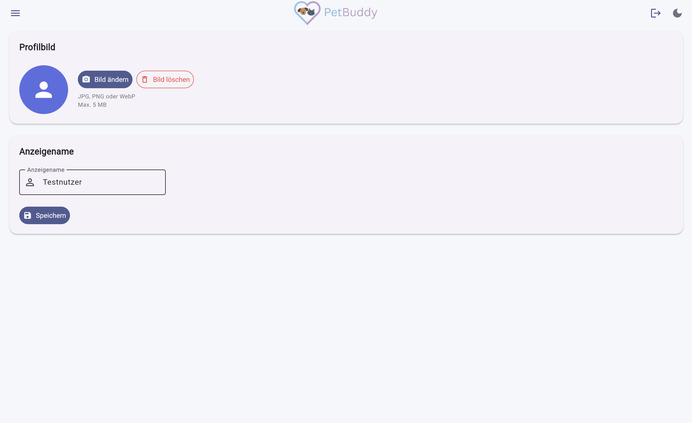

# Profil bearbeiten

Ihr Profil repräsentiert Sie in der PetBuddy-Community. Es besteht aus einem Benutzernamen und einem optionalen Profilbild. Diese Funktion dient dazu, Ihre öffentlichen Informationen zu verwalten und zu personalisieren.

!!! info "Anmeldung erforderlich"
    Dieser Bereich ist nur für angemeldete Nutzer zugänglich.

So gelangen Sie zum Profil: Menü → **Profil bearbeiten**

*Abbildung: Menüpunkt "Profil bearbeiten"*

*Abbildung: Bereich "Profil bearbeiten"*

---

## Benutzername ändern

Um unter einem anderen Namen in der App zu erscheinen, geben Sie den neuen Namen in das Textfeld ein und klicken Sie auf **Speichern**. Der Name wird sofort überall aktualisiert.

---

## Profilbild

Ein Profilbild hilft anderen Nutzern, Sie schneller wiederzuerkennen.

- **Hochladen**: Klicken Sie auf **Bild ändern** und wählen Sie ein Bild aus.
- **Löschen**: Klicken Sie auf **„Bild löschen"**, um zum Standard-Avatar zurückzukehren.
