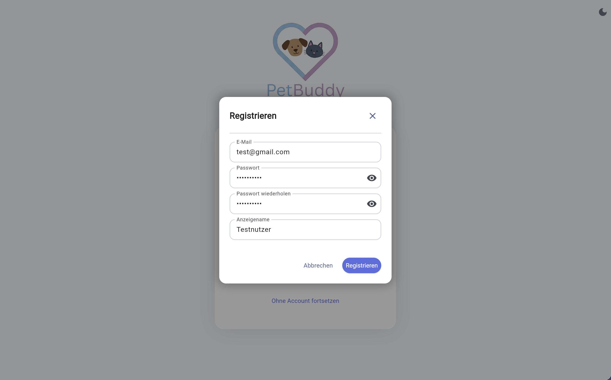
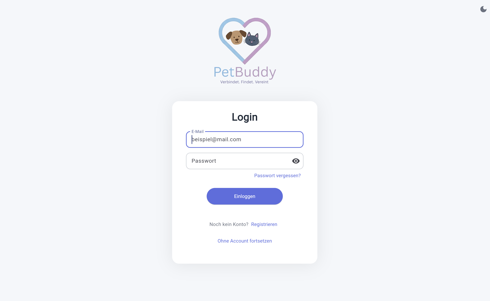
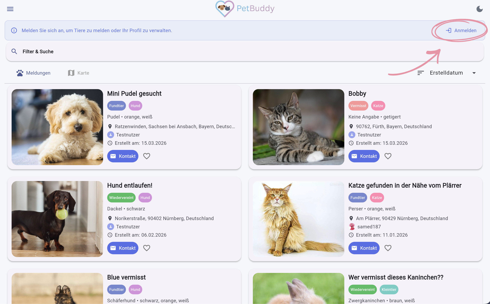
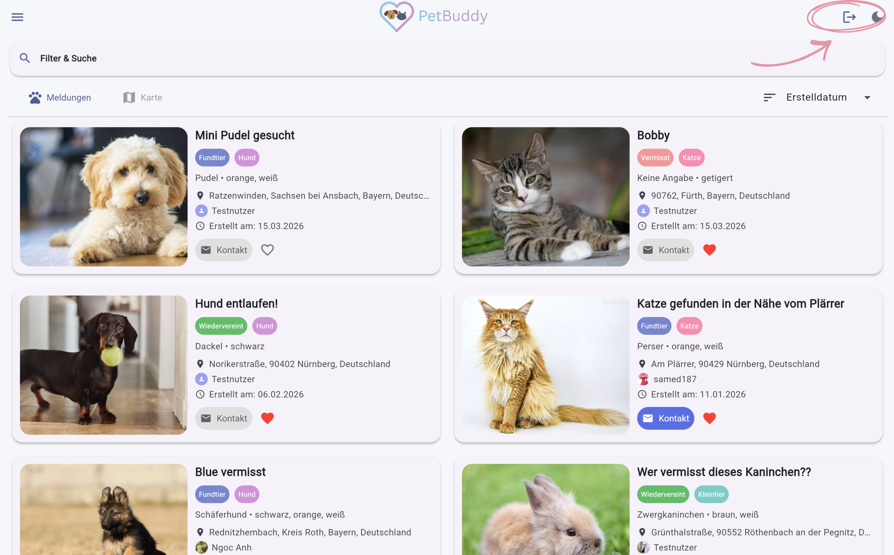

# Registrierung & Anmeldung

Um PetBuddy vollständig nutzen zu können, benötigen Sie ein Benutzerkonto. Mit einem Konto können Sie Meldungen erstellen, kommentieren, Favoriten setzen und Ihr Profil verwalten. Ohne Anmeldung steht Ihnen ein eingeschränkter Gastmodus zur Verfügung (siehe [Übersicht](index.md#gastmodus)).

---

## Registrieren

Sie möchten PetBuddy zum ersten Mal nutzen? Erstellen Sie ein kostenloses Konto:

1. Öffnen Sie das Seitenmenü (☰) und wählen Sie **Anmelden**.
2. Wählen Sie **Registrieren**.
3. Füllen Sie folgende Felder aus:
    - E-Mail-Adresse
    - Passwort (mind. 8 Zeichen, Groß-/Kleinbuchstabe, Zahl, Sonderzeichen)
    - Passwort bestätigen
    - Benutzername (wird öffentlich angezeigt)
4. Klicken Sie auf **Registrieren**.
5. Sie erhalten eine Bestätigungs-E-Mail von **noreply@mail.app.supabase.io**. Klicken Sie auf den Link in der E-Mail, um Ihr Konto zu aktivieren.

*Abbildung: Registrierungsformular*

!!! warning "Kein automatisches Anmelden"
    Nach der Registrierung werden Sie **nicht** automatisch angemeldet. Bitte bestätigen Sie zuerst Ihre E-Mail-Adresse und melden Sie sich anschließend manuell an.

---

## Anmelden

Sie haben bereits ein Konto? Melden Sie sich an, um alle Funktionen zu nutzen:

1. Menü → **Anmelden**
2. E-Mail und Passwort eingeben → **Anmelden**

*Abbildung: Anmeldeformular*

!!! tip "Gastmodus"
    Ohne Anmeldung können Sie Meldungen durchsuchen und ansehen. Im Gastmodus erscheint ein Banner mit einem **Anmelden**-Button oben auf der Startseite.

*Abbildung: Banner im Gastmodus*

---

## Abmelden

Klicken Sie auf das **Logout-Symbol** in der AppBar oder wählen Sie im Menü **Abmelden**.

*Abbildung: Abmelden*