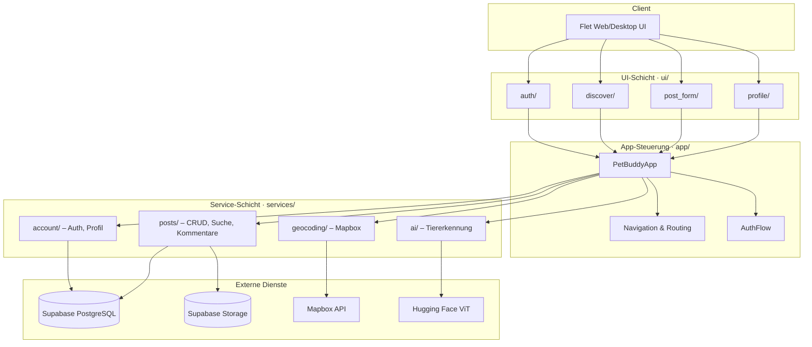
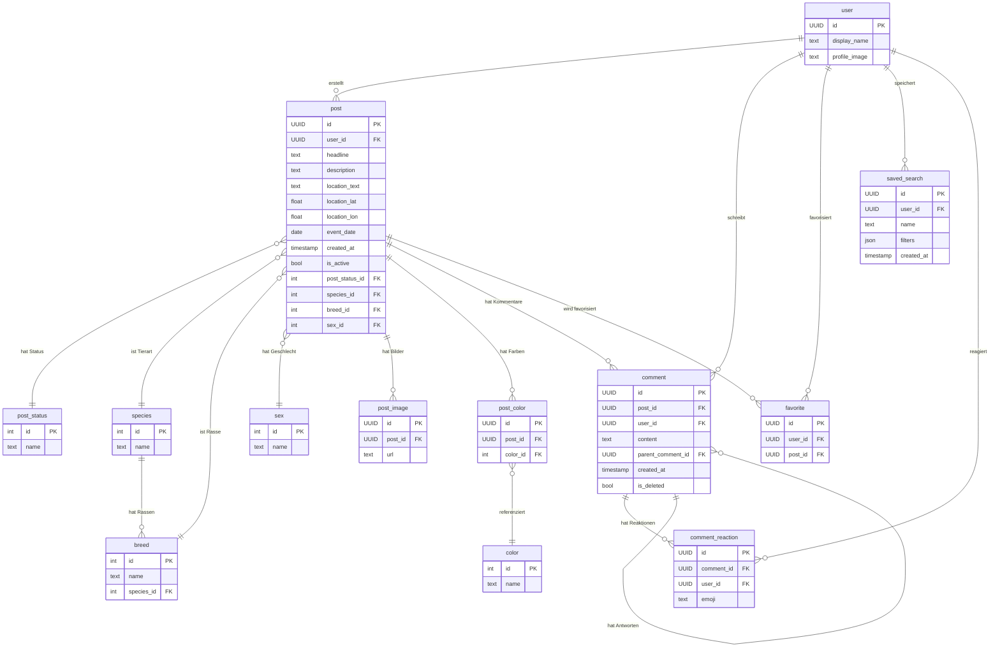

# Technische Dokumentation

<a id="technische-dokumentation"></a>

Diese Seite beschreibt die technische Konzeption von PetBuddy – Architektur, Datenmodell und die wichtigsten Module. Sie richtet sich an Entwickler und technisch Interessierte.

---

## Architekturdiagramm

PetBuddy folgt einer **Schichtenarchitektur** mit klarer Trennung von UI, Geschäftslogik und Datenzugriff.



### Schichten im Überblick

| Schicht | Verzeichnis | Aufgabe |
|---------|-------------|---------|
| **Einstiegspunkt** | `main.py` → `app/app.py` | Flet-App starten, Routing, Theme |
| **UI** | `ui/` | Views, Components, Handler (je Feature) |
| **App-Steuerung** | `app/` | Navigation, Drawer, Auth-Flow, Dialoge |
| **Services** | `services/` | Geschäftslogik, Supabase-Zugriff |
| **Utils** | `utils/` | Logging, PDF-Export, Validierung, Karten |
| **Externe Dienste** | — | Supabase (DB + Storage), Mapbox, Hugging Face |

---

## Datenbankmodell

Die Daten liegen in **Supabase (PostgreSQL)**. Nachfolgend das logische Datenmodell:



### Lookup-Tabellen

| Tabelle | Inhalt |
|---------|--------|
| `post_status` | „Vermisst", „Gefunden" |
| `species` | „Hund", „Katze", „Vogel", … |
| `breed` | Rassen je Tierart |
| `color` | Fellfarben |
| `sex` | „Männlich", „Weiblich", „Unbekannt" |

### Storage Buckets (Supabase)

| Bucket | Zweck | Limits |
|--------|-------|--------|
| `pet-images` | Meldungsfotos | max. 10 MB, komprimiert auf 1920×1920 px |
| `profile-images` | Profilbilder | — |

---

## API-Referenz / Modulbeschreibung

Da PetBuddy eine **Flet-Anwendung** ist (kein REST-Backend), liegt die Geschäftslogik in der Service-Schicht. Nachfolgend die wichtigsten Module und ihre Funktionen.

### `services/account/` – Benutzerverwaltung

| Modul | Klasse | Wichtige Methoden |
|-------|--------|-------------------|
| `auth.py` | `AuthService` | `login()`, `register()`, `password_reset()` |
| `profile.py` | `ProfileService` | `get_current_user()`, `update_display_name()`, `get_user_profiles()` |
| `profile_image.py` | `ProfileImageService` | `upload_profile_image()`, `delete_profile_image()` |
| `account_deletion.py` | `AccountDeletionService` | `delete_account()` – kaskadiert Posts, Bilder, Kommentare |

### `services/posts/` – Meldungsverwaltung

| Modul | Klasse / Funktion | Wichtige Methoden |
|-------|-------------------|-------------------|
| `post.py` | `PostService` | `create()`, `update()`, `delete()`, `get_post_by_id()`, `get_posts()` |
| `search.py` | `SearchService` | `search()` – kombiniert Filter, Sortierung, Standort |
| `filters.py` | Hilfsfunktionen | `filter_by_search()`, `filter_by_colors()`, `filter_by_location()`, `sort_by_event_date()`, `enrich_with_distance()` |
| `comment.py` | `CommentService` | `get_comments()`, `add_comment()`, `add_reaction()`, `remove_reaction()` |
| `favorites.py` | `FavoritesService` | `get_favorites()`, `add_favorite()`, `remove_favorite()` |
| `saved_search.py` | `SavedSearchService` | `get_saved_searches()`, `create_saved_search()`, `delete_saved_search()` |
| `references.py` | `ReferenceService` | `get_post_statuses()`, `get_species()`, `get_breeds_by_species()`, `get_colors()` |
| `post_image.py` | `PostStorageService` | `upload_post_image()`, `remove_post_image()` – JPEG-Komprimierung |
| `post_relations.py` | `PostRelationsService` | `add_color()`, `update_colors()`, `add_photo()` |

### `services/geocoding/` – Standortdienste

| Modul | Funktion | Beschreibung |
|-------|----------|--------------|
| `mapbox_geocoding.py` | `geocode_suggestions()` | Mapbox-Autocomplete → `{text, lat, lon}` |

### `services/ai/` – Künstliche Intelligenz

| Modul | Klasse | Beschreibung |
|-------|--------|--------------|
| `pet_recognition.py` | `PetRecognitionService` | `recognize_pet()` – Bilderkennung via Hugging Face ViT (google/vit-base-patch16-224) |

### `utils/` – Hilfsfunktionen

| Modul | Zweck |
|-------|-------|
| `logging_config.py` | Zentrales Logging (Konsole + Datei) |
| `pdf_generator.py` | PDF-Export von Meldungen (ReportLab) |
| `map_generator.py` | Kartenansicht (Folium/Leaflet) |
| `validators.py` | Eingabevalidierung |
| `constants.py` | App-weite Konstanten |

---

## Dateistruktur

```
Projektarbeit_2026/
├── main.py                  # Einstiegspunkt
├── app/
│   ├── app.py               # PetBuddyApp – Hauptklasse
│   ├── navigation.py        # Drawer, AppBar, Routing
│   ├── auth_flow.py         # Login/Logout-Workflow
│   └── dialogs.py           # Wiederverwendbare Dialoge
├── ui/                      # Feature-basierte UI-Module
│   ├── auth/                # Anmeldung / Registrierung
│   ├── discover/            # Entdecken, Suche, Karte
│   ├── post_form/           # Meldung erstellen / bearbeiten
│   ├── profile/             # Profil, Favoriten, Einstellungen
│   ├── theme.py             # ThemeManager (Hell/Dunkel)
│   └── shared_components.py # Gemeinsame UI-Elemente
├── services/                # Geschäftslogik & Datenzugriff
│   ├── supabase_client.py   # Singleton Supabase-Client
│   ├── account/             # Auth, Profil, Löschung
│   ├── posts/               # CRUD, Suche, Kommentare
│   ├── geocoding/           # Mapbox-Integration
│   └── ai/                  # Tiererkennung (ViT)
├── utils/                   # Logging, PDF, Karten, Validierung
├── deploy/
│   ├── Dockerfile           # Multi-Stage Docker Build
│   └── fly.toml             # Fly.io Konfiguration
└── documentation/           # MkDocs-Dokumentation
```

---

## Tech-Stack

| Kategorie | Technologie |
|-----------|-------------|
| **Sprache** | Python 3.13+ |
| **UI-Framework** | Flet 0.28.3 (Web + Desktop) |
| **Datenbank** | Supabase (PostgreSQL + Auth + Storage) |
| **Geocoding** | Mapbox API |
| **KI-Modell** | Hugging Face ViT (google/vit-base-patch16-224) |
| **Bildverarbeitung** | Pillow (Komprimierung, Resize) |
| **PDF** | ReportLab |
| **Karten** | Folium / Leaflet |
| **Deployment** | Fly.io (Docker, Frankfurt, 2 GB RAM) |
| **Dokumentation** | MkDocs Material |
