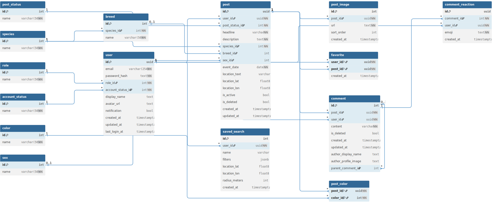

# Datenbankmodell

Die Daten liegen in **Supabase (PostgreSQL)**. Nachfolgend das logische Datenmodell.

> [Interaktive Version auf dbdiagram.io öffnen](https://dbdiagram.io/d/PetBuddy_aktualisiert-69cab413fb2db18e3b3cb630){:target="_blank"} 

---

## Lookup-Tabellen

| Tabelle | Inhalt |
|---------|--------|
| `post_status` | „Vermisst", „Fundtier", „Wiedervereint" |
| `species` | „Hund", „Katze", „Kleintier" |
| `breed` | Rassen je Tierart (dynamisch geladen) |
| `color` | Fellfarben |
| `sex` | „Männlich", „Weiblich" |

---

## Storage Buckets (Supabase)

| Bucket | Zweck | Limits |
|--------|-------|--------|
| `pet-images` | Meldungsfotos | max. 10 MB, komprimiert auf 1920×1920 px |
| `profile-images` | Profilbilder | max. 10 MB |

---

## Hinweis zu Lookup-Tabellen

Die Lookup-Tabellen für `role` und `account_status` wurden bereits im Datenmodell angelegt, werden in der aktuellen Anwendungsversion jedoch noch nicht aktiv verwendet.

Sie sind als Vorbereitung für zukünftige Funktionen vorgesehen, insbesondere für Moderation und erweiterte Rollen-/Statuslogik.

---